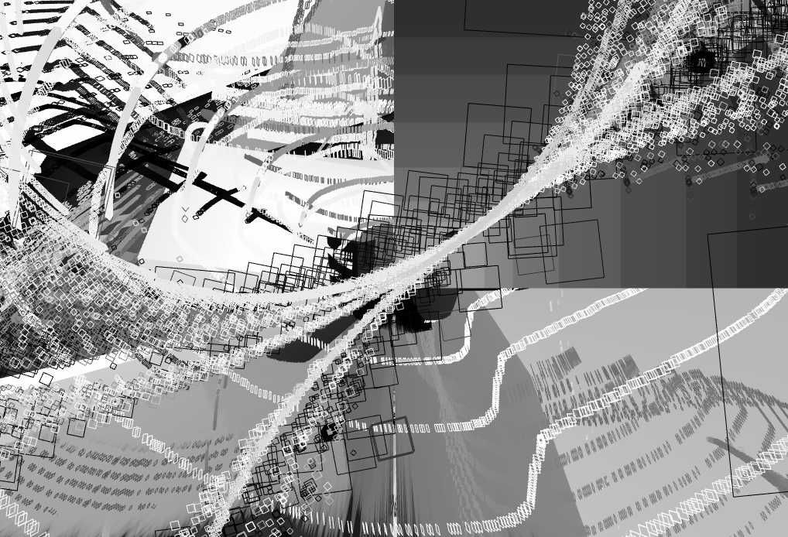

# Visuals ~

This repo must be inside [OpenFramework](https://github.com/openframeworks/openFrameworks)'s library folder in order to compile the programs

i.e. install OpenFrameworks then place this repository at openFrameworks/apps/[thisrepo]

# Status

## YingYangTunnel

This animation can be compiled and visualized by `cd /Visuals/YingYangTunnel && make && make run`.

Source code is in the `YingYangTunnel` directory.

A high resolution preview of the result can be downloaded here: https://github.com/Sleepful/Visuals/blob/master/YingYangTunnel/output/Spin.mov

A gif preview can be found here, but in gif it is quite slow, you have to look at it long enough to appreciate it:

## Experimentation

# useful commands 

`make`: build project

`make run`: run project

`make copy_dlls`: copies dlls from project (if running with msys2)

# to install OF

clone OF repo, then run the install scripts at openFrameworks/scripts, and add this repo in the /apps subfolder of OF (as submodule or just copy paste it)

# to run on windows with msys2 installed 

add to windows path:
* `c:\msys64\mingw32\bin` (or mingw64 depending)
* `c:\msys64\usr\bin`

in order for windows to find the dlls without having to use `make copy_dlls`
